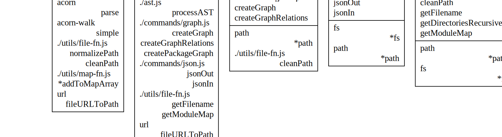
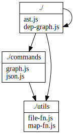
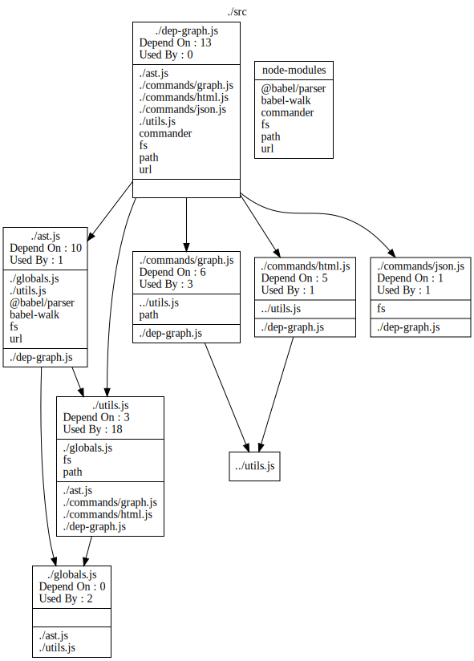

# Description

A cli program to generate dependency .dot files for use with [Graphviz](https://graphviz.org/).

It can process a file or a directory. For a directory it processes recursively.

From root directory where this file is.

1. install for testing<br>
  `npm install -g .`
2. uninstall<br>
  `npm uninstall -g dep-graph`
3. when installed<br>
  `dep-graph -g -j -o ./dep-out ./src/server`
4. run from the command line using node<br>
 `node . -g -j ./src`
5. get help<br>
`node . --help`
6. test (not really working.<br>
`yarn test`
7. Create a svg file from a .dot file. Assumes you have graphviz installed<br>
 `dot -Tsvg srcPackage.dot -o srcPackage.svg`

## Options

If only -g option is used it assumes the json files exist. If they do not exist it will fail.

|     |     |     |
|----- | --- | --- |
|-V | --version |output the version number
|-g |--graph|produces package and dependencies  .dot files that graphviz <br>can use to generate a graph of the dependencies to <br>output directory (see files produced).
|-j |--json    |produce .json object files used to output directory (see files produced).
|-o |--output \<dir\> | directory that the outputs are sent to. (default: "./out")
|-h |--help |display help for command

# Plans

If you try it out and it does not work drop me an email. It is my first pass so I'm happy to try and improve it if you have some suggestions. Make a pull request if you want to change it yourself. Some ideas I have for future work include. Let me know any favourites. *Money or work would be gratefully accepted as I am not working at the moment.*

- Enable it to parse typescript (ts) jsx and tsx files into the graph
- Create hyperlinks
- Add JSDocs links.
- Make the graph production more configurable
- Any useful user suggestion.
- Fix bugs and errors
- Add in types and parameters for exported functions
- See what happens for node modules.

## Other Projects

Some other ideas I have for future projects. These would change source.

- Generate JSDoc for functions.
- Convert js files to typescript.

# Files Produced

Files are prefixed with the <directory | filename> that was the base for the dependency graph and outputted to the output directory. e.g

`dep-graph -g -j -o ./dep-out ./src/server`

will produce the following files in the dep-out directory.

- serverPackage.dot
- serverDependencies.dot
- serverRelations.dot
- serverDependencyList.json
- serverExportList.json
- serverImportMap.json
- serverModuleMap.json
- serverErrors.json

Examples of the files exist in ./\_\_tests__/out-eg directory

# Graphviz files

The -g option produces .dot files in the output directory which contain the following structures.

A * indicates it is the default export/import.

## Dependencies.dot

<br>
<table>
<tr>
<th>Description</th>
<th>Format</th></tr>
<tr>
<td>The graphviz file used to produce a graph of module dependencies</td>
<td>

--------------------

- module name

--------------------

- exported functions list

--------------------

- imported modules list (left justified)
- imported functions list for the module (right justified)

--------------------
</td></tr>
</table>



## Package.dot

<br>
<table>
<table>
<tr><th>Description</th>
<th>Format</th></tr>


<tr>
<td>The graphviz file used to produce a graph of package dependencies.</td>
<td>

--------------------

- directory or package name

--------------------

- file/module in the directory

--------------------
</tr>
</table>

**Relation**

\<Module> - *Depends on* -> \<Module>



## Relations.dot

<br>
<table>
<table>
<tr><th>Description</th>
<th>Format</th></tr>


<tr>
<td>The graphviz file used to produce a graph of relations between files. Includes node_moducle relationship where depended on in a module. </td>
<td>

--------------------

- module name
- Depends On : *Number of modules*
- Used By : *Number of modules*

--------------------

- list of modules that it depends on.

--------------------

- list of modules that are used by the module.

--------------------
</tr>
</table>

**Relation**

\<Module> - *Depend on* -> \<Module>



# Json Files

The -j option produces .json files in the output directory which contain the following structures.

Package - a directory containing files.

Module -  a file in a directory.

<br>
<table>
<tr><td> DependencyList.json </td>
<td>A list of dependencies containing the
<table>
<tr><td> src </td><td> the file containing the import</td></tr>
<tr><td>importSrc</td><td> where the import is from </td></tr>
<tr><td> import </td><td> the imported function.</td></tr>
</table>
</td></tr>
<tr><td>ExportList.json </td>
<td>A list of exports containing the
<br> - name - the file the export is in <br> - exported - what is exported <br> - type - type of export|
<tr><td>ImportMap.json </td><td> A map of imports <br> -key - the import name <br> - value - an array of functions that are exported.</td></tr>
<tr><td>ModuleMap.json </td><td> A map of modules in the directory <br> - key - the name of the package/directory <br> - value - an array of imports from the package.</td></tr>
<tr><td>Error.json  </td><td> The AST parse fails for some syntax or the file is not a .js file. This will result in this file. <br> - file - the file being processes that causes the error. <br> - err - the error generated <br> - msg - the error message or warning that the file was not a .js <br> - src - the name of the module in dep-graph generating the error.</td></tr>
</table>

## Json Examples

### DependencyList

```json
[ 
  {
    "src": "./ast.js",
    "importSrc": "fs",
    "import": "writeFileSync"
  },
  {
    "src": "./ast.js",
    "importSrc": "fs",
    "import": "readFileSync"
  } 
]
  ```

### ExportList

```json
[
  {
    "name": "./ast.js",
    "exported": "processAST",
    "type": "FunctionDeclaration"
  },
  {
    "name": "./ast.js",
    "exported": "getImportMap",
    "type": "FunctionDeclaration"
  }
]
  ```  

### ImportMap

```json
{
  "fs": [
    "writeFileSync",
    "readFileSync",
    "fstat",
    "*fs"
  ],
  "acorn": [
    "parse"
  ],
  "./utils/file-fn.js": [
    "normalizePath",
    "getModuleMap"
  ]
}
  ```  

### ModuleMap

```json
{
  "./": [
    "./ast.js",
    "./dep-graph.js"
  ],
  "./commands": [
    "./commands/graph.js",
    "./commands/json.js"
  ],
  "./utils": [
    "./utils/file-fn.js",
    "./utils/map-fn.js"
  ]
}
  ```

### Errors

```json

[
  {
    "file": "./src/components/forms/index.js",
    "err": {
      "pos": 7,
      "loc": {
        "line": 1,
        "column": 7
      },
      "raisedAt": 18
    },
    "msg": "Unexpected token (1:7)",
    "src": "C:\\Code\\dep-graph\\src\\ast.js"
  }
]  

```